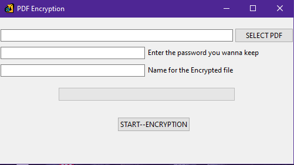

# Pdf-Encryptor-Using-Python
A GUI Application that is able to Create a password protected version of any given PDF file. Made completely from python

MODULES =>> Threading(For Progress Bar), Tkinter(For GUI), Time(For using sleep method in threading), filedialouge(To select pdf files fr encryption), PIL(For image assets),

NOTE:==>> Do change the path for the icon image for tkinter window

Application::==>>

